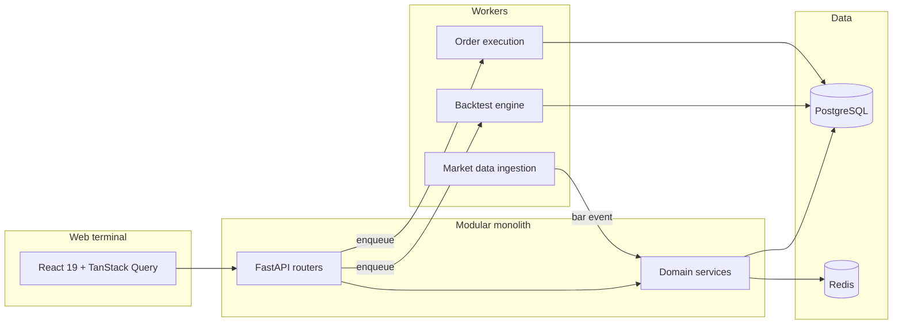

# AlphaEdge — Case Study

**Author:** [Your Name]  
**Role:** Full-stack / backend engineer (quant platform)  
**Stack:** Python 3.12 · FastAPI · Celery · PostgreSQL · Redis · React 19 · C++17 (pybind11)  
**Scale:** 19 bounded contexts · 144 tests · 63+ API routes · ~58% unit coverage

---

## Problem

Quantitative researchers need a single environment to **author** trading rules, **validate** them, **backtest** on historical data, **optimize** parameters, and **paper-trade** before risking capital — without gluing together five different tools.

Most portfolio projects stop at a CRUD app or a single backtest script. AlphaEdge is an end-to-end **research terminal**: web UI, async job engine, risk checks, and optional live broker routing.

---

## Solution overview

**Research loop:** Author (DSL/Python) → Validate (compiler + AST) → Backtest (Celery) → Optimize (grid / walk-forward / Bayesian) → Deploy to paper → Manual or Alpaca execution.

---

## Architecture decisions

### 1. Modular monolith over microservices

| Choice | Rationale |
|--------|-----------|
| One repo, one deploy | Faster iteration for a solo/small team; Docker Compose runs everything |
| Bounded contexts | `strategy`, `execution`, `risk`, etc. keep domains isolated without network overhead |
| Layered modules | `domain → application → infrastructure → presentation` enforces dependency direction |

**Tradeoff:** Cannot scale backtest workers independently without splitting later — acceptable for research workloads.

### 2. DSL + Python dual runtime

- **DSL (YAML):** Declarative signals (`crossover(sma(10), sma(30))`) — validated, hashed, optionally accelerated in C++.
- **Python:** `StrategyBase` subclass with `on_bar()` — AST blocks dangerous imports; runtime uses a **restricted `__import__`** allowing only `alphaedge.modules.strategy.domain`.

**Tradeoff:** Python is not OS-sandboxed (`exec()` in-process). Documented as **trusted environments only** — not multi-tenant safe without containers.

### 3. Event-driven backtest, synchronous deployment evaluation

Backtests replay bars through `BacktestEngine` (Python or C++ path). Paper deployments hook into market-data ingestion: each new bar triggers `evaluate_deployments_for_bar` → signal → `SubmitOrderHandler` → Celery.

**Tradeoff:** Ingestion worker blocks on deployment count — profile before scaling.

### 4. Risk gate as a single choke point

Every order — API or deployment — passes `RiskGate.evaluate()` before persistence. Six stages: sizing, exposure, cash/MIS margin, sell validation, drawdown/VaR limits, daily loss.

**Tradeoff:** Price estimate from latest daily bar, not live quotes.

---

## Hardest technical problems

### DSL compiler pipeline

Parse YAML → validate indicators/parameters → compile to `CompiledStrategy` → SHA-256 hash for versioning. Extended to comparisons, `all()`/`any()`, stop/take-profit metadata.

### C++ backtest accelerator

pybind11 extension (`backend/cpp/`) for crossover/crossunder DSL on large bar sets.

| Path | Throughput (1M events) |
|------|------------------------|
| C++ core | ~12M events/sec |
| C++ end-to-end (incl. Decimal conversion) | ~475K events/sec |
| Python (extrapolated) | ~154K events/sec |

**78× speedup** on core path vs Python — enables parameter sweeps without waiting minutes per trial.

### Order idempotency under retries

Unique `idempotency_key` in Postgres; deployment orders use deterministic keys per bar/side. Celery retries won't double-fill.

### Cookie auth + WebSocket tickets

OAuth tokens in HTTP-only cookies (no URL leakage). Production WebSockets use single-use Redis tickets via `Sec-WebSocket-Protocol`.

---

## What ships today (honest scope)

| Capability | Status |
|------------|--------|
| DSL + Python backtests | Production-ready |
| Paper trading + deployments | Production-ready |
| Pre-trade risk gate | Production-ready |
| Alpaca manual orders | Supported when enabled |
| Live auto-trading | Not implemented |
| Indian / crypto / options brokers | Stubs or not implemented |

See [README capability matrix](../README.md#capability-matrix).

---

## Engineering quality

- **144 automated tests** — unit, integration, e2e (Playwright)
- **CI:** ruff, pytest, pip-audit (backend); oxlint, npm audit, tsc build (frontend)
- **Observability:** Prometheus metrics, Grafana dashboards, structlog with `request_id`
- **Documentation:** Architecture, strategy guide, security audit, deployment runbook, engineering audit

---

## What I'd do next

1. **Public demo** — seeded read-only deploy (Render/Fly)
2. **Strategy isolation** — containerized worker per untrusted strategy
3. **mypy strict in CI** — clear ~400-type backlog
4. **Market-hours + quote freshness** in execution path

---

## Links

- [Interview talking points](INTERVIEW_TALKING_POINTS.md)
- [Engineering audit (v1.0)](ENGINEERING_AUDIT_V1.md)
- [Architecture](architecture/ARCHITECTURE.md)
- [Strategy guide](STRATEGY_GUIDE.md)

---

*Use this document as a one-pager for recruiters or as prep before system-design interviews.*
