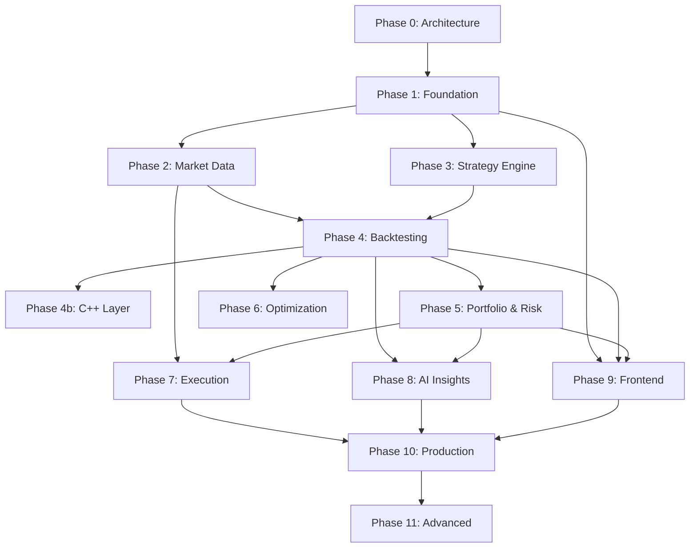

# AlphaEdge — Development Roadmap

## Overview

Development proceeds in **phases**, each delivering a vertical slice of functionality. Every phase follows the standard workflow:

1. Architecture explanation
2. Database design (migrations)
3. API design (OpenAPI)
4. Folder structure
5. Backend implementation
6. Tests
7. Performance review
8. Improvement suggestions
9. Git commit

**Approval is required before starting each phase.**

---

## Phase 0 — Architecture & Planning ✅

**Status:** Complete (this commit)

**Deliverables:**
- [x] System architecture document
- [x] Repository structure specification
- [x] Conceptual database schema
- [x] API design overview
- [x] Development roadmap

**Exit criteria:** Architecture reviewed and approved by stakeholder.

---

## Phase 1 — Foundation & Identity ✅

**Status:** Complete

**Deliverables:**
- [x] Monorepo scaffolding (backend, frontend skeleton, docker)
- [x] Docker Compose dev stack (Postgres, Redis, API, worker)
- [x] FastAPI app factory with middleware (CORS, auth, logging, error handling)
- [x] Shared kernel (value objects, event bus, unit of work, outbox)
- [x] Alembic setup with initial migration
- [x] Identity module (register, login, JWT, refresh tokens, RBAC)
- [x] Health check endpoints
- [x] Structured logging + Prometheus metrics
- [x] GitHub Actions CI (lint, type check, unit tests)
- [x] Makefile with dev commands

**Database tables:** `users`, `roles`, `user_roles`, `refresh_tokens`, `api_keys`, `audit_log`, `outbox_events`

**API endpoints:** `/auth/*`, `/health/*`

**Tests:** Domain unit tests, auth integration tests, health check tests.

**Estimated scope:** ~40 files, foundational infrastructure.

---

## Phase 2 — Market Data ✅

**Status:** Complete

**Deliverables:**
- [x] Instrument registry (CRUD)
- [x] Provider adapter interface + mock provider
- [x] Alpha Vantage adapter (optional API key)
- [x] Ingestion pipeline (validation, normalization, storage)
- [x] Indexed `bars` table with composite primary key
- [x] Bar query API with pagination and date range filters
- [x] Celery ingestion tasks
- [x] Seed script with sample data
- [x] Redis caching for latest bars

**Database tables:** `instruments`, `bars`, `corporate_actions`, `data_ingestion_jobs`

**API endpoints:** `/instruments/*`, `/market-data/*`

**Tests:** Normalizer unit tests, ingestion integration tests, bar query tests.

---

## Phase 3 — Strategy Engine ✅

**Status:** Complete

**Deliverables:**
- [x] Strategy CRUD with versioning
- [x] Python strategy base class (`StrategyBase`)
- [x] DSL parser and validator (YAML-based)
- [x] Indicator library (SMA, EMA, RSI, MACD, Bollinger Bands)
- [x] Strategy compilation and validation pipeline
- [x] Indicator catalog API

**Database tables:** `strategies`, `strategy_versions`, `indicators`

**API endpoints:** `/strategies/*`, `/indicators`

**Tests:** DSL parser tests, indicator unit tests, strategy validation tests.

---

## Phase 4 — Backtesting Engine ✅

**Status:** Complete

**Deliverables:**
- [x] Event-driven backtest engine (Python)
- [x] Slippage models (fixed, percentage)
- [x] Commission/brokerage simulation
- [x] Position sizing (fixed quantity, percent equity)
- [x] Partial fill simulation
- [x] Multi-asset support
- [x] Backtest job submission via Celery
- [x] Results storage (metrics, trades, equity curve)
- [x] Backtest API (submit, status, results, trades, equity curve)
- [x] CLI backtest runner

**Database tables:** `backtest_runs`, `backtest_results`, `backtest_trades`

**API endpoints:** `/backtest-runs/*`

**Tests:** Fill simulation tests, backtest engine integration tests, metric calculation tests.

---

## Phase 4b — C++ Performance Layer ✅

**Status:** Complete

**Goal:** Accelerate backtest hot path with C++ module.

**Deliverables:**
- [x] C++ event loop with pybind11 bindings (`backend/cpp`, module `alphaedge_cpp`)
- [x] C++ indicator implementations (SMA, EMA, RSI, MACD, Bollinger)
- [x] C++ fill simulator (slippage, commission, partial fills, position sizing)
- [x] Benchmark suite comparing Python vs C++ paths (`scripts/benchmark_backtest.py`)
- [x] Automatic fallback (Python if C++ unavailable; `CPP_ENGINE=auto|off|require`)

**Performance target:** 1M events in < 5 seconds. **Achieved: ~0.1s (10M events/sec), ~62x faster than the Python path per event.**

**Build:** `make build-cpp` (optional; the DSL engine transparently uses it when installed).

---

## Phase 5 — Portfolio & Risk ✅

**Status:** Complete

**Goal:** Portfolio tracking and institutional-grade risk analytics.

**Deliverables:**
- [x] Portfolio CRUD and holdings tracking
- [x] Holdings updated on backtest/execution events (`POST /portfolios/{id}/sync-from-backtest`)
- [x] Risk metric calculations (VaR, Sharpe, Sortino, drawdown, beta, alpha)
- [x] Risk snapshot generation (on-demand + Celery task)
- [x] Risk limit enforcement
- [x] Rebalancing plan generation
- [x] Portfolio and risk APIs

**Database tables:** `portfolios`, `holdings`, `rebalance_plans`, `risk_snapshots`, `risk_limits`

**API endpoints:** `/portfolios/*`, `/portfolios/{id}/risk/*`

**Tests:** Risk metric unit tests (known inputs → expected outputs), portfolio integration tests.

---

## Phase 6 — Optimization Engine ✅

**Status:** Complete

**Goal:** Automated strategy parameter optimization.

**Deliverables:**
- [x] Grid search optimizer (parallel trial tasks via Celery)
- [x] Optimization run management
- [x] Trial result storage and ranking
- [x] Optimization API
- [x] Walk-forward testing support

**Database tables:** `optimization_runs`, `optimization_trials`

**API endpoints:** `/optimization-runs/*`

**Tests:** Grid/walk-forward domain unit tests, optimization integration tests.

---

## Phase 7 — Execution Layer ✅

**Status:** Complete

**Goal:** Paper trading with broker abstraction.

**Deliverables:**
- [x] Broker port interface
- [x] Paper broker implementation
- [x] Order lifecycle management
- [x] Fill simulation with market data
- [x] Order retry mechanism
- [x] Execution audit trail
- [x] Broker connection management
- [x] Order API

**Database tables:** `broker_connections`, `orders`, `executions`, `order_events`

**API endpoints:** `/broker-connections/*`, `/orders/*`

**Tests:** Paper broker unit tests, order integration tests.

---

## Phase 8 — AI Insights Layer ✅

**Status:** Complete

**Goal:** LLM-powered analysis and reporting.

**Deliverables:**
- [x] Prompt template system (versioned)
- [x] Strategy explanation generator
- [x] Performance report generator
- [x] Risk interpretation generator
- [x] Trade summary generator
- [x] Async Celery task pipeline
- [x] Insights API

**Database tables:** `insight_requests`, `insight_reports`

**API endpoints:** `/insights/*`

**Tests:** Prompt/LLM unit tests, insight integration tests.

---

## Phase 9 — Frontend

**Goal:** React dashboard for core workflows.

**Deliverables:**
- [ ] Auth pages (login, register)
- [ ] Strategy editor (Python + DSL)
- [ ] Backtest submission and results dashboard
- [ ] Portfolio overview
- [ ] Risk dashboard with charts
- [ ] Order management view
- [ ] AI insights viewer
- [ ] Responsive layout with Tailwind

---

## Phase 10 — Production Hardening

**Goal:** Production-ready deployment.

**Deliverables:**
- [ ] OAuth integration (Google, GitHub)
- [ ] Live market data WebSocket streaming
- [ ] Alpaca broker adapter (live trading)
- [ ] AWS deployment (ECS/RDS/ElastiCache)
- [ ] Nginx reverse proxy configuration
- [ ] Grafana dashboards
- [ ] Load testing and performance benchmarks
- [ ] Security audit
- [ ] API rate limiting tiers

---

## Phase 11 — Advanced Features (Future)

- Bayesian optimization (Optuna)
- Genetic algorithm optimizer
- Kubernetes deployment
- TimescaleDB for market data
- Multi-tenant support
- Strategy marketplace
- Real-time collaboration on strategies

---

## Dependency Graph

---

## Current Status

| Phase | Status |
|-------|--------|
| Phase 0 — Architecture | ✅ Complete |
| Phase 1 — Foundation & Identity | ✅ Complete |
| Phase 2 — Market Data | ✅ Complete |
| Phase 3 — Strategy Engine | ✅ Complete |
| Phase 4 — Backtesting | ✅ Complete |
| Phase 4b — C++ Layer | ✅ Complete |
| Phase 5 — Portfolio & Risk | ✅ Complete |
| Phase 6 — Optimization | ✅ Complete |
| Phase 7 — Execution | ✅ Complete |
| Phase 8 — AI Insights | ✅ Complete |
| Phase 9–11 | 🔒 Not started |

**Action required:** Review Phase 8 implementation and approve Phase 9 to begin frontend dashboard.
