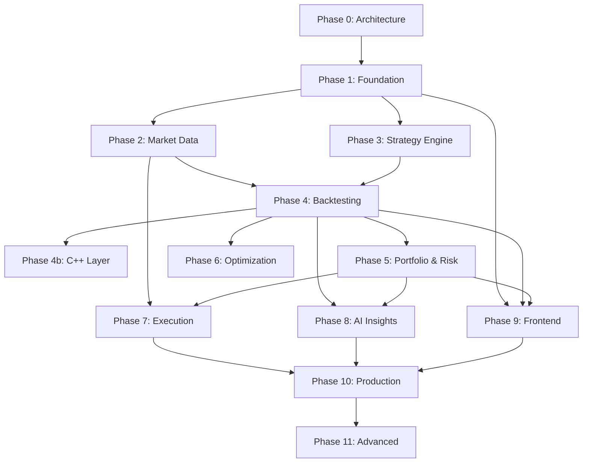

# AlphaEdge — Development Roadmap

## Overview

Development proceeds in **phases**, each delivering a vertical slice of functionality. Every phase follows the standard workflow:

1. Architecture explanation
2. Database design (migrations)
3. API design (OpenAPI)
4. Folder structure
5. Backend implementation
6. Tests
7. Performance review
8. Improvement suggestions
9. Git commit

**Approval is required before starting each phase.**

---

## Phase 0 — Architecture & Planning ✅

**Status:** Complete (this commit)

**Deliverables:**
- [x] System architecture document
- [x] Repository structure specification
- [x] Conceptual database schema
- [x] API design overview
- [x] Development roadmap

**Exit criteria:** Architecture reviewed and approved by stakeholder.

---

## Phase 1 — Foundation & Identity ✅

**Status:** Complete

**Deliverables:**
- [x] Monorepo scaffolding (backend, frontend skeleton, docker)
- [x] Docker Compose dev stack (Postgres, Redis, API, worker)
- [x] FastAPI app factory with middleware (CORS, auth, logging, error handling)
- [x] Shared kernel (value objects, event bus, unit of work, outbox)
- [x] Alembic setup with initial migration
- [x] Identity module (register, login, JWT, refresh tokens, RBAC)
- [x] Health check endpoints
- [x] Structured logging + Prometheus metrics
- [x] GitHub Actions CI (lint, type check, unit tests)
- [x] Makefile with dev commands

**Database tables:** `users`, `roles`, `user_roles`, `refresh_tokens`, `api_keys`, `audit_log`, `outbox_events`

**API endpoints:** `/auth/*`, `/health/*`

**Tests:** Domain unit tests, auth integration tests, health check tests.

**Estimated scope:** ~40 files, foundational infrastructure.

---

## Phase 2 — Market Data

**Goal:** Ingest, store, and serve historical OHLCV data.

**Deliverables:**
- [ ] Instrument registry (CRUD)
- [ ] Provider adapter interface + mock provider
- [ ] Polygon/Alpha Vantage adapter (one real provider)
- [ ] Ingestion pipeline (validation, normalization, storage)
- [ ] Partitioned `bars` table
- [ ] Bar query API with pagination and date range filters
- [ ] Celery ingestion tasks
- [ ] Seed script with sample data
- [ ] Redis caching for latest bars

**Database tables:** `instruments`, `bars`, `corporate_actions`, `data_ingestion_jobs`

**API endpoints:** `/instruments/*`, `/market-data/*`

**Tests:** Normalizer unit tests, ingestion integration tests, bar query tests.

---

## Phase 3 — Strategy Engine

**Goal:** Create, version, and validate trading strategies.

**Deliverables:**
- [ ] Strategy CRUD with versioning
- [ ] Python strategy base class (`StrategyBase`)
- [ ] DSL parser and validator (YAML-based)
- [ ] Indicator library (SMA, EMA, RSI, MACD, Bollinger Bands)
- [ ] Strategy compilation and validation pipeline
- [ ] Indicator catalog API

**Database tables:** `strategies`, `strategy_versions`, `indicators`

**API endpoints:** `/strategies/*`, `/indicators`

**Tests:** DSL parser tests, indicator unit tests, strategy validation tests.

---

## Phase 4 — Backtesting Engine

**Goal:** Event-driven backtesting with realistic simulation.

**Deliverables:**
- [ ] Event-driven backtest engine (Python)
- [ ] Slippage models (fixed, percentage)
- [ ] Commission/brokerage simulation
- [ ] Position sizing (fixed quantity, percent equity)
- [ ] Partial fill simulation
- [ ] Multi-asset support
- [ ] Backtest job submission via Celery
- [ ] Results storage (metrics, trades, equity curve)
- [ ] Backtest API (submit, status, results, trades, equity curve)
- [ ] CLI backtest runner

**Database tables:** `backtest_runs`, `backtest_results`, `backtest_trades`

**API endpoints:** `/backtest-runs/*`

**Tests:** Fill simulation tests, backtest engine integration tests, metric calculation tests.

**Performance target:** 1M events in < 30 seconds (Python); C++ module deferred to Phase 4b.

---

## Phase 4b — C++ Performance Layer

**Goal:** Accelerate backtest hot path with C++ module.

**Deliverables:**
- [ ] C++ event loop with pybind11 bindings
- [ ] C++ indicator implementations
- [ ] C++ fill simulator
- [ ] Benchmark suite comparing Python vs C++ paths
- [ ] Automatic fallback (Python if C++ unavailable)

**Performance target:** 1M events in < 5 seconds.

---

## Phase 5 — Portfolio & Risk

**Goal:** Portfolio tracking and institutional-grade risk analytics.

**Deliverables:**
- [ ] Portfolio CRUD and holdings tracking
- [ ] Holdings updated on backtest/execution events
- [ ] Risk metric calculations (VaR, Sharpe, Sortino, drawdown, beta, alpha)
- [ ] Risk snapshot generation (on-demand + scheduled)
- [ ] Risk limit enforcement
- [ ] Rebalancing plan generation
- [ ] Portfolio and risk APIs

**Database tables:** `portfolios`, `holdings`, `rebalance_plans`, `risk_snapshots`, `risk_limits`

**API endpoints:** `/portfolios/*`, `/portfolios/{id}/risk/*`

**Tests:** Risk metric unit tests (known inputs → expected outputs), portfolio integration tests.

---

## Phase 6 — Optimization Engine

**Goal:** Automated strategy parameter optimization.

**Deliverables:**
- [ ] Grid search optimizer (parallel via Celery)
- [ ] Optimization run management
- [ ] Trial result storage and ranking
- [ ] Optimization API
- [ ] Walk-forward testing support

**Database tables:** `optimization_runs`, `optimization_trials`

**API endpoints:** `/optimization-runs/*`

---

## Phase 7 — Execution Layer

**Goal:** Paper trading with broker abstraction.

**Deliverables:**
- [ ] Broker port interface
- [ ] Paper broker implementation
- [ ] Order lifecycle management
- [ ] Fill simulation with market data
- [ ] Order retry mechanism
- [ ] Execution audit trail
- [ ] Broker connection management
- [ ] Order API

**Database tables:** `broker_connections`, `orders`, `executions`, `order_events`

**API endpoints:** `/broker-connections/*`, `/orders/*`

---

## Phase 8 — AI Insights Layer

**Goal:** LLM-powered analysis and reporting.

**Deliverables:**
- [ ] Prompt template system (versioned)
- [ ] Strategy explanation generator
- [ ] Performance report generator
- [ ] Risk interpretation generator
- [ ] Trade summary generator
- [ ] Async Celery task pipeline
- [ ] Insights API

**Database tables:** `insight_requests`, `insight_reports`

**API endpoints:** `/insights/*`

---

## Phase 9 — Frontend

**Goal:** React dashboard for core workflows.

**Deliverables:**
- [ ] Auth pages (login, register)
- [ ] Strategy editor (Python + DSL)
- [ ] Backtest submission and results dashboard
- [ ] Portfolio overview
- [ ] Risk dashboard with charts
- [ ] Order management view
- [ ] AI insights viewer
- [ ] Responsive layout with Tailwind

---

## Phase 10 — Production Hardening

**Goal:** Production-ready deployment.

**Deliverables:**
- [ ] OAuth integration (Google, GitHub)
- [ ] Live market data WebSocket streaming
- [ ] Alpaca broker adapter (live trading)
- [ ] AWS deployment (ECS/RDS/ElastiCache)
- [ ] Nginx reverse proxy configuration
- [ ] Grafana dashboards
- [ ] Load testing and performance benchmarks
- [ ] Security audit
- [ ] API rate limiting tiers

---

## Phase 11 — Advanced Features (Future)

- Bayesian optimization (Optuna)
- Genetic algorithm optimizer
- Kubernetes deployment
- TimescaleDB for market data
- Multi-tenant support
- Strategy marketplace
- Real-time collaboration on strategies

---

## Dependency Graph

---

## Current Status

| Phase | Status |
|-------|--------|
| Phase 0 — Architecture | ✅ Complete |
| Phase 1 — Foundation & Identity | ✅ Complete |
| Phase 2 — Market Data | ⏳ Awaiting approval |
| Phase 3–11 | 🔒 Not started |

**Action required:** Review Phase 1 implementation and approve Phase 2 to begin market data ingestion.
