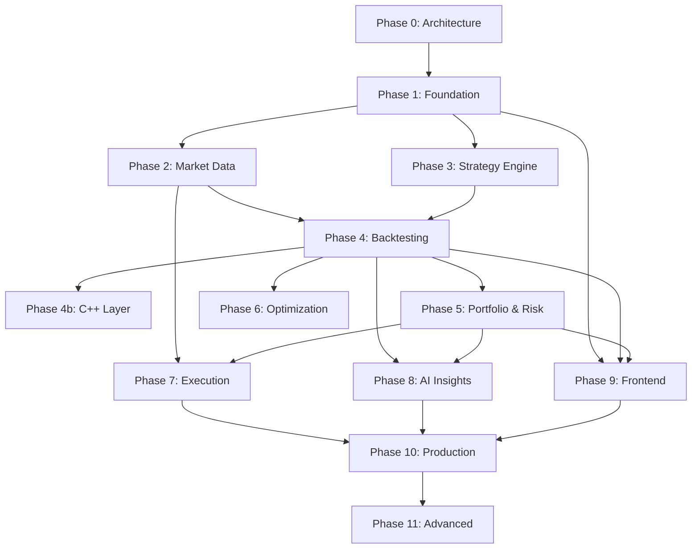
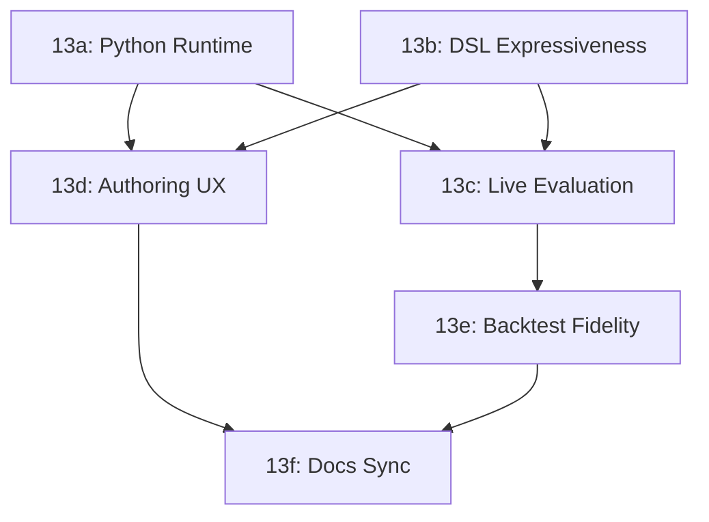

# AlphaEdge — Development Roadmap

## Overview

Development proceeds in **phases**, each delivering a vertical slice of functionality. Every phase follows the standard workflow:

1. Architecture explanation
2. Database design (migrations)
3. API design (OpenAPI)
4. Folder structure
5. Backend implementation
6. Tests
7. Performance review
8. Improvement suggestions
9. Git commit

**Approval is required before starting each phase.**

---

## Phase 0 — Architecture & Planning ✅

**Status:** Complete (this commit)

**Deliverables:**
- [x] System architecture document
- [x] Repository structure specification
- [x] Conceptual database schema
- [x] API design overview
- [x] Development roadmap

**Exit criteria:** Architecture reviewed and approved by stakeholder.

---

## Phase 1 — Foundation & Identity ✅

**Status:** Complete

**Deliverables:**
- [x] Monorepo scaffolding (backend, frontend skeleton, docker)
- [x] Docker Compose dev stack (Postgres, Redis, API, worker)
- [x] FastAPI app factory with middleware (CORS, auth, logging, error handling)
- [x] Shared kernel (value objects, event bus, unit of work, outbox)
- [x] Alembic setup with initial migration
- [x] Identity module (register, login, JWT, refresh tokens, RBAC)
- [x] Health check endpoints
- [x] Structured logging + Prometheus metrics
- [x] GitHub Actions CI (lint, type check, unit tests)
- [x] Makefile with dev commands

**Database tables:** `users`, `roles`, `user_roles`, `refresh_tokens`, `api_keys`, `audit_log`, `outbox_events`

**API endpoints:** `/auth/*`, `/health/*`

**Tests:** Domain unit tests, auth integration tests, health check tests.

**Estimated scope:** ~40 files, foundational infrastructure.

---

## Phase 2 — Market Data ✅

**Status:** Complete

**Deliverables:**
- [x] Instrument registry (CRUD)
- [x] Provider adapter interface + mock provider
- [x] Alpha Vantage adapter (optional API key)
- [x] Ingestion pipeline (validation, normalization, storage)
- [x] Indexed `bars` table with composite primary key
- [x] Bar query API with pagination and date range filters
- [x] Celery ingestion tasks
- [x] Seed script with sample data
- [x] Redis caching for latest bars

**Database tables:** `instruments`, `bars`, `corporate_actions`, `data_ingestion_jobs`

**API endpoints:** `/instruments/*`, `/market-data/*`

**Tests:** Normalizer unit tests, ingestion integration tests, bar query tests.

---

## Phase 3 — Strategy Engine ✅

**Status:** Complete

**Deliverables:**
- [x] Strategy CRUD with versioning
- [x] Python strategy base class (`StrategyBase`)
- [x] DSL parser and validator (YAML-based)
- [x] Indicator library (SMA, EMA, RSI, MACD, Bollinger Bands)
- [x] Strategy compilation and validation pipeline
- [x] Indicator catalog API

**Database tables:** `strategies`, `strategy_versions`, `indicators`

**API endpoints:** `/strategies/*`, `/indicators`

**Tests:** DSL parser tests, indicator unit tests, strategy validation tests.

---

## Phase 4 — Backtesting Engine ✅

**Status:** Complete

**Deliverables:**
- [x] Event-driven backtest engine (Python)
- [x] Slippage models (fixed, percentage)
- [x] Commission/brokerage simulation
- [x] Position sizing (fixed quantity, percent equity)
- [x] Partial fill simulation
- [x] Multi-asset support
- [x] Backtest job submission via Celery
- [x] Results storage (metrics, trades, equity curve)
- [x] Backtest API (submit, status, results, trades, equity curve)
- [x] CLI backtest runner

**Database tables:** `backtest_runs`, `backtest_results`, `backtest_trades`

**API endpoints:** `/backtest-runs/*`

**Tests:** Fill simulation tests, backtest engine integration tests, metric calculation tests.

---

## Phase 4b — C++ Performance Layer ✅

**Status:** Complete

**Goal:** Accelerate backtest hot path with C++ module.

**Deliverables:**
- [x] C++ event loop with pybind11 bindings (`backend/cpp`, module `alphaedge_cpp`)
- [x] C++ indicator implementations (SMA, EMA, RSI, MACD, Bollinger)
- [x] C++ fill simulator (slippage, commission, partial fills, position sizing)
- [x] Benchmark suite comparing Python vs C++ paths (`scripts/benchmark_backtest.py`)
- [x] Automatic fallback (Python if C++ unavailable; `CPP_ENGINE=auto|off|require`)

**Performance target:** 1M events in < 5 seconds. **Achieved: ~0.1s (10M events/sec), ~62x faster than the Python path per event.**

**Build:** `make build-cpp` (optional; the DSL engine transparently uses it when installed).

---

## Phase 5 — Portfolio & Risk ✅

**Status:** Complete

**Goal:** Portfolio tracking and institutional-grade risk analytics.

**Deliverables:**
- [x] Portfolio CRUD and holdings tracking
- [x] Holdings updated on backtest/execution events (`POST /portfolios/{id}/sync-from-backtest`)
- [x] Risk metric calculations (VaR, Sharpe, Sortino, drawdown, beta, alpha)
- [x] Risk snapshot generation (on-demand + Celery task)
- [x] Risk limit enforcement
- [x] Rebalancing plan generation
- [x] Portfolio and risk APIs

**Database tables:** `portfolios`, `holdings`, `rebalance_plans`, `risk_snapshots`, `risk_limits`

**API endpoints:** `/portfolios/*`, `/portfolios/{id}/risk/*`

**Tests:** Risk metric unit tests (known inputs → expected outputs), portfolio integration tests.

---

## Phase 6 — Optimization Engine ✅

**Status:** Complete

**Goal:** Automated strategy parameter optimization.

**Deliverables:**
- [x] Grid search optimizer (parallel trial tasks via Celery)
- [x] Optimization run management
- [x] Trial result storage and ranking
- [x] Optimization API
- [x] Walk-forward testing support

**Database tables:** `optimization_runs`, `optimization_trials`

**API endpoints:** `/optimization-runs/*`

**Tests:** Grid/walk-forward domain unit tests, optimization integration tests.

---

## Phase 7 — Execution Layer ✅

**Status:** Complete

**Goal:** Paper trading with broker abstraction.

**Deliverables:**
- [x] Broker port interface
- [x] Paper broker implementation
- [x] Order lifecycle management
- [x] Fill simulation with market data
- [x] Order retry mechanism
- [x] Execution audit trail
- [x] Broker connection management
- [x] Order API

**Database tables:** `broker_connections`, `orders`, `executions`, `order_events`

**API endpoints:** `/broker-connections/*`, `/orders/*`

**Tests:** Paper broker unit tests, order integration tests.

---

## Phase 8 — AI Insights Layer ✅

**Status:** Complete

**Goal:** LLM-powered analysis and reporting.

**Deliverables:**
- [x] Prompt template system (versioned)
- [x] Strategy explanation generator
- [x] Performance report generator
- [x] Risk interpretation generator
- [x] Trade summary generator
- [x] Async Celery task pipeline
- [x] Insights API

**Database tables:** `insight_requests`, `insight_reports`

**API endpoints:** `/insights/*`

**Tests:** Prompt/LLM unit tests, insight integration tests.

---

## Phase 9 — Frontend ✅

**Status:** Complete

**Goal:** React dashboard for core workflows.

**Deliverables:**
- [x] Auth pages (login, register)
- [x] Strategy editor (Python + DSL)
- [x] Backtest submission and results dashboard
- [x] Portfolio overview
- [x] Risk dashboard with charts
- [x] Order management view
- [x] AI insights viewer
- [x] Responsive layout with Tailwind
- [x] Trading-terminal UI (ticker tape, market clock, activity feed, dark theme)

**Stack:** React 19, Vite, Tailwind CSS v4, TanStack Query, Recharts.

**Run:** `cd frontend && npm install && npm run dev` (API proxy → `localhost:8000`).

---

## Phase 10 — Production Hardening ✅

**Status:** Complete

**Goal:** Production-ready deployment.

**Deliverables:**
- [x] OAuth integration (Google, GitHub)
- [x] Live market data WebSocket streaming (`/api/v1/ws/market-data`)
- [x] Alpaca broker adapter (live trading with paper fallback)
- [x] AWS deployment scaffold (ECS cluster Terraform + README)
- [x] Nginx reverse proxy configuration
- [x] Grafana dashboards (Prometheus API metrics)
- [x] Load testing script (`backend/scripts/load_test.py`)
- [x] Security audit document
- [x] API rate limiting tiers (Redis sliding window + API keys)

---

## Phase 11 — Advanced Features ✅

**Status:** Complete

**Goal:** Next-generation quant platform capabilities.

**Deliverables:**
- [x] Bayesian optimization (Optuna) — `method: bayesian`
- [x] Genetic algorithm optimizer — `method: genetic`
- [x] Kubernetes deployment manifests (`infrastructure/k8s/`)
- [x] TimescaleDB extension migration (optional hypertable path)
- [x] Multi-tenant organizations (`/organizations/*`)
- [x] Strategy marketplace (`/marketplace/*` publish, list, clone)
- [x] Real-time strategy collaboration (`/collaboration/*` + WebSocket)

---

## Dependency Graph

---

## Current Status

| Phase | Status |
|-------|--------|
| Phase 0 — Architecture | ✅ Complete |
| Phase 1 — Foundation & Identity | ✅ Complete |
| Phase 2 — Market Data | ✅ Complete |
| Phase 3 — Strategy Engine | ✅ Complete |
| Phase 4 — Backtesting | ✅ Complete |
| Phase 4b — C++ Layer | ✅ Complete |
| Phase 5 — Portfolio & Risk | ✅ Complete |
| Phase 6 — Optimization | ✅ Complete |
| Phase 7 — Execution | ✅ Complete |
| Phase 8 — AI Insights | ✅ Complete |
| Phase 9 — Frontend | ✅ Complete |
| Phase 10 — Production Hardening | ✅ Complete |
| Phase 11 — Advanced Features | ✅ Complete |

**All roadmap phases complete.** Post-roadmap deliverables (Phase 12):

- [x] Marketplace & collaboration frontend
- [x] Stripe marketplace payments (mock + live Stripe)
- [x] Live trading production guards & runbook
- [x] PWA manifest (installable web app)
- [x] Expo mobile app (`mobile/`)

---

## Phase 13 — Strategy Depth & Live Execution

**Status:** Complete (13a–13f)

**Goal:** Close the gap between architecture docs and runtime behavior. Today DSL strategies run end-to-end in backtests (Python or C++), but Python strategies only validate — they never execute. Live/paper trading is order-driven, not strategy-driven. The DSL is limited to crossover/crossunder between two indicators.

**Why now:** Phases 0–12 delivered the platform shell. Phase 13 makes the strategy engine the product it was designed to be.

### 13a — Python Strategy Runtime (P0) ✅

**Problem:** `BacktestEngine._build_executor` raises for Python strategies; the UI still lets users create them.

**Deliverables:**
- [x] `PythonStrategyExecutor` — load user class via restricted import sandbox, instantiate `StrategyBase` subclass, call `on_init` / `on_bar` / `on_stop`
- [x] Wire executor into `BacktestEngine` (Python path only; C++ remains DSL-only)
- [x] Shared indicator helpers exposed on `StrategyContext` (reuse `INDICATOR_REGISTRY`)
- [x] Unit tests: golden-cross equivalent in Python, import-guard rejection cases
- [x] Frontend: Python starter template; validate & backtest flow

**Exit criteria:** A Python strategy with `on_bar` returning BUY/SELL backtests successfully and produces trades.

### 13b — DSL Expressiveness (P1) ✅

**Problem:** Only `crossover(a, b)` and `crossunder(a, b)` are supported. No thresholds (`rsi(14) < 30`), no AND/OR, no stop-loss/take-profit metadata on signals.

**Deliverables:**
- [x] Comparison conditions: `>`, `<`, `>=`, `<=`, `==` between indicator refs and numeric literals or parameters
- [x] Boolean composition: `all(...)`, `any(...)` for grouped conditions
- [x] Optional signal metadata: `strength`, `stop_loss_pct`, `take_profit_pct` (stored on `Signal`, honored by engine)
- [x] Extend `DSLStrategyExecutor` (Python path; C++ bridge unchanged)
- [x] Parser/validator tests + RSI template in codebase
- [x] Frontend: indicator sidebar; DSL condition hints

**Exit criteria:** RSI oversold/overbought and multi-condition strategies validate, backtest, and match Python-path results.

### 13c — Live Strategy Evaluation (P1) ✅

**Problem:** Architecture describes `BarIngested → Strategy (live signal eval) → Order`, but execution only accepts manual/API orders.

**Deliverables:**
- [x] `StrategyDeployment` entity: links `strategy_version_id`, `portfolio_id`, `broker_connection_id`, instruments, sizing config, active flag
- [x] Bar-ingestion hook: on new bar, run executor → signal
- [x] Order submission from signal (BUY/SELL → `SubmitOrder`)
- [x] API: deploy/pause/list deployments
- [x] Frontend: "Deploy to paper" flow from validated strategy version
- [ ] Integration test: mock bar → signal → paper order (unit coverage; full integration optional)

**Exit criteria:** A deployed DSL strategy on paper broker auto-places orders when bars arrive.

### 13d — Strategy Authoring UX (P2) ✅

**Problem:** Parameters live in JSONB but the editor only exposes `source_code`. Validation-before-backtest is enforced server-side but easy to miss in the UI.

**Deliverables:**
- [x] Parameters panel on `StrategyDetailPage` (key/value editor synced with version JSONB)
- [ ] Inline validation errors in editor (parse API errors with line hints)
- [x] "Validate & Backtest" one-click flow when version is dirty
- [x] Indicator catalog sidebar (from `GET /indicators`) with insert snippets
- [x] Python strategy: starter template with `StrategyBase` skeleton

**Exit criteria:** User can edit parameters without touching raw YAML; unvalidated versions show blocking UI before backtest submit.

### 13e — Backtest Fidelity (P2) ✅

**Problem:** Long-only simulation; HOLD is a no-op; short selling documented in architecture but not implemented.

**Deliverables:**
- [x] `allow_short` flag on `BacktestConfig` (default false for backward compatibility)
- [x] Engine: SELL opens short when flat and shorts allowed; BUY covers short
- [x] Metrics: separate long/short trade stats when enabled
- [x] Document behavior in README and API schema

**Exit criteria:** Short-enabled backtest produces short positions and correct P&L.

### 13f — Documentation Sync (P3) ✅

**Problem:** `ARCHITECTURE.md` still states no implementation exists; roadmap marked everything complete while runtime gaps remain.

**Deliverables:**
- [x] Update `ARCHITECTURE.md` §9 implementation status and live-signal flow
- [x] Add `docs/STRATEGY_GUIDE.md` — DSL reference, Python runtime, deployment lifecycle
- [x] README "Known limitations" section pointing to remaining gaps

**Exit criteria:** New developer can read docs and understand what works vs what is planned without reading source.

---

### Phase 13 Dependency Graph

### Phase 13 Priority Summary

| Track | Priority | Effort | User impact |
|-------|----------|--------|-------------|
| 13a Python runtime | P0 | Medium | Unblocks half the strategy editor |
| 13b DSL expressiveness | P1 | Medium | Real-world rule authoring |
| 13c Live evaluation | P1 | Large | Paper trading that actually trades |
| 13d Authoring UX | P2 | Small–Medium | Fewer validate/backtest mistakes |
| 13e Short selling | P2 | Medium | Institutional realism |
| 13f Docs sync | P3 | Small | Onboarding clarity |

**Approval is required before starting each sub-phase.**
