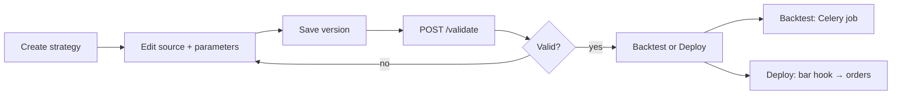

# AlphaEdge Strategy Guide

This guide describes how strategies work in the **current codebase** — what you can author, how they run in backtests, and how paper deployments evaluate signals.

For system-wide architecture, see [ARCHITECTURE.md](architecture/ARCHITECTURE.md). For API endpoint shapes, see [API_OVERVIEW.md](architecture/API_OVERVIEW.md).

---

## 1. Strategy types

| Type | Authoring | Validate | Backtest | Paper deploy |
|------|-----------|----------|----------|--------------|
| **DSL** (YAML) | `strategy.yaml` in version `source_code` | Compile YAML → hash | Python or C++ engine | Yes |
| **Python** | `StrategyBase` subclass | AST import guard | Python engine only | Yes (DSL/Python runtime) |

Both types are versioned. Each edit creates a new `strategy_version` row. Backtests and deployments reference a **specific version id**.

---

## 2. Lifecycle



1. **Create** — `POST /api/v1/strategies` with `strategy_type: dsl|python` and optional initial source.
2. **Version** — `POST /api/v1/strategies/{id}/versions` with `source_code` and optional `parameters` JSON.
3. **Validate** — `POST .../versions/{vid}/validate` sets status to `validated` and stores `compiled_hash`.
4. **Backtest** — `POST /api/v1/backtest-runs` (requires validated version; Celery worker must be running).
5. **Deploy to paper** — `POST /api/v1/strategy-deployments` (paper broker only; evaluates on each ingested bar).

The UI mirrors this on **Strategies → detail**: parameters panel, indicator sidebar, **Validate & Backtest**, and **Deploy to paper**.

---

## 3. DSL reference

### 3.1 Structure

```yaml
name: my-strategy
parameters:
  fast: 10
  slow: 30
  rsi_period: 14
  oversold: 30
signals:
  - when: crossover(sma(fast), sma(slow))
    then: BUY
  - when: crossunder(sma(fast), sma(slow))
    then: SELL
```

### 3.2 Indicators

| Function | Example | Notes |
|----------|---------|-------|
| `sma(arg)` | `sma(fast)`, `sma(20)` | `arg` = parameter name or integer literal |
| `ema(arg)` | `ema(12)` | Same |
| `rsi(arg)` | `rsi(rsi_period)` | Returns 0–100 |
| `macd(arg)` | `macd(12)` | Uses `fast_period`, `slow_period`, `signal_period` from parameters when set |
| `bollinger(arg)` | `bollinger(20)` | Uses `std_dev` from parameters (default 2.0) |

### 3.3 Conditions

| Form | Example |
|------|---------|
| Crossover | `crossover(sma(fast), sma(slow))` |
| Crossunder | `crossunder(sma(fast), sma(slow))` |
| Comparison | `rsi(14) < 30`, `sma(fast) > sma(slow)` |
| Operators | `<`, `>`, `<=`, `>=`, `==` |
| Boolean AND | `all(crossover(sma(fast), sma(slow)), rsi(14) < 30)` |
| Boolean OR | `any(rsi(14) < 30, rsi(14) > 70)` |

Rules are evaluated **top to bottom**; the first matching rule wins.

### 3.4 Actions

| Action | Backtest (default) | Backtest (`allow_short: true`) |
|--------|-------------------|-------------------------------|
| `BUY` | Open long (skip if already long) | Cover short, or open long |
| `SELL` | Close long (skip if flat) | Close long, or open short when flat |
| `HOLD` | No-op | No-op |

### 3.5 Signal metadata (optional)

```yaml
signals:
  - when: rsi(rsi_period) < oversold
    then: BUY
    stop_loss_pct: 3
    take_profit_pct: 6
    strength: 0.8
```

- `stop_loss_pct` / `take_profit_pct` — honored in the Python backtest engine (long and short).
- `strength` — stored on the signal; reserved for future sizing logic.

### 3.6 C++ backtest path

DSL strategies use the optional `alphaedge_cpp` extension when:

- `CPP_ENGINE=auto` (default) and the extension is built (`make build-cpp`)
- Strategy uses only `crossover` / `crossunder` (no comparisons, `all`/`any`, or signal metadata)
- `allow_short` is **false**

Otherwise the pure-Python engine runs.

---

## 4. Python strategies

### 4.1 Template

```python
from alphaedge.modules.strategy.domain import StrategyBase, Signal, SignalAction

class MyStrategy(StrategyBase):
    def on_init(self, context):
        self.fast = context.indicator("sma", "fast_period")
        self.slow = context.indicator("sma", "slow_period")

    def on_bar(self, bar, context):
        fast = self.fast.update(bar.close)
        slow = self.slow.update(bar.close)
        if fast is None or slow is None:
            return None
        if fast > slow:
            return Signal(action=SignalAction.BUY, reason="fast above slow")
        if fast < slow:
            return Signal(action=SignalAction.SELL, reason="fast below slow")
        return None
```

### 4.2 Sandbox rules (trusted environments only)

Python strategies are **not** run in an OS-level sandbox. They execute in the same process as the API/worker via `exec()` with:

- **Static AST validation** — blocks dangerous imports (`os`, `sys`, `subprocess`, …) and calls (`eval`, `exec`, `open`, `__import__`, …)
- **Restricted builtins** — whitelisted names only; `__import__` is excluded from the runtime namespace
- **Injected API** — `StrategyBase`, indicators, `Signal`, `Decimal` only

**Suitable for:** single-user research, trusted code authors, private deployments.

**Not suitable for:** multi-tenant SaaS, marketplace strategies from untrusted authors, or production live trading without additional isolation (containers, separate worker pools, etc.).

- Must define **exactly one** `StrategyBase` subclass.
- `on_tick` is optional; backtests and deployments are bar-driven today.

### 4.3 `StrategyContext`

| Field / method | Purpose |
|----------------|---------|
| `parameters` | Version JSON parameters |
| `context.indicator(name, period)` | Stateful SMA/EMA/RSI/MACD/Bollinger instance |
| `position`, `cash` | Reserved for future live context wiring |

---

## 5. Backtest configuration

Submit via `POST /api/v1/backtest-runs`:

```json
{
  "strategy_version_id": "<uuid>",
  "name": "AAPL 2024",
  "config": {
    "instrument_ids": ["<uuid>"],
    "timeframe": "1d",
    "start_date": "2024-01-01T00:00:00+00:00",
    "end_date": "2024-12-31T00:00:00+00:00",
    "initial_capital": "100000",
    "allow_short": false,
    "position_sizing": { "model": "percent_equity", "value": 0.1 },
    "slippage": { "model": "fixed", "value": "0.01" },
    "commission": { "per_trade": "1.0" },
    "partial_fill_ratio": "1.0"
  }
}
```

When `allow_short` is `true`, results include `metrics.long_trades` and `metrics.short_trades` breakdowns.

---

## 6. Paper deployments

### 6.1 Create deployment

```http
POST /api/v1/strategy-deployments
```

```json
{
  "strategy_version_id": "<validated-version-uuid>",
  "portfolio_id": "<uuid>",
  "broker_connection_id": "<paper-broker-uuid>",
  "instrument_ids": ["<uuid>"],
  "quantity": "10"
}
```

### 6.2 Runtime behavior

```
Bar ingested (market data job)
  → evaluate_deployments_for_bar(bar)
  → StrategyRuntime.on_bar(bar) per active deployment
  → BUY/SELL → SubmitOrder → Celery execute_order
```

- Deployments require a **validated** version and an **active paper** broker connection.
- Executor state is cached per deployment id; **pause** clears the cache.
- Orders use idempotency keys per bar/side to avoid duplicates.

### 6.3 Manage

| Endpoint | Action |
|----------|--------|
| `GET /strategy-deployments` | List your deployments |
| `POST /strategy-deployments/{id}/pause` | Stop evaluating |
| `POST /strategy-deployments/{id}/resume` | Re-activate |

---

## 7. Known gaps

| Area | Status |
|------|--------|
| Short selling in deployments | Backtests only; deployments are long-only order mapping today |
| `HOLD` action | Ignored in backtest engine; logged in paper deployments (no order placed) |
| C++ engine | No comparisons, shorts, or signal metadata |
| Live (non-paper) auto-trading | Deployments require paper broker |
| Risk limits on auto-orders | Deployment orders pass through `SubmitOrderHandler` and `RiskGate` |
| Tick strategies | `on_tick` not wired to streaming |

See [README.md](../README.md#known-limitations) for platform-wide limitations.
