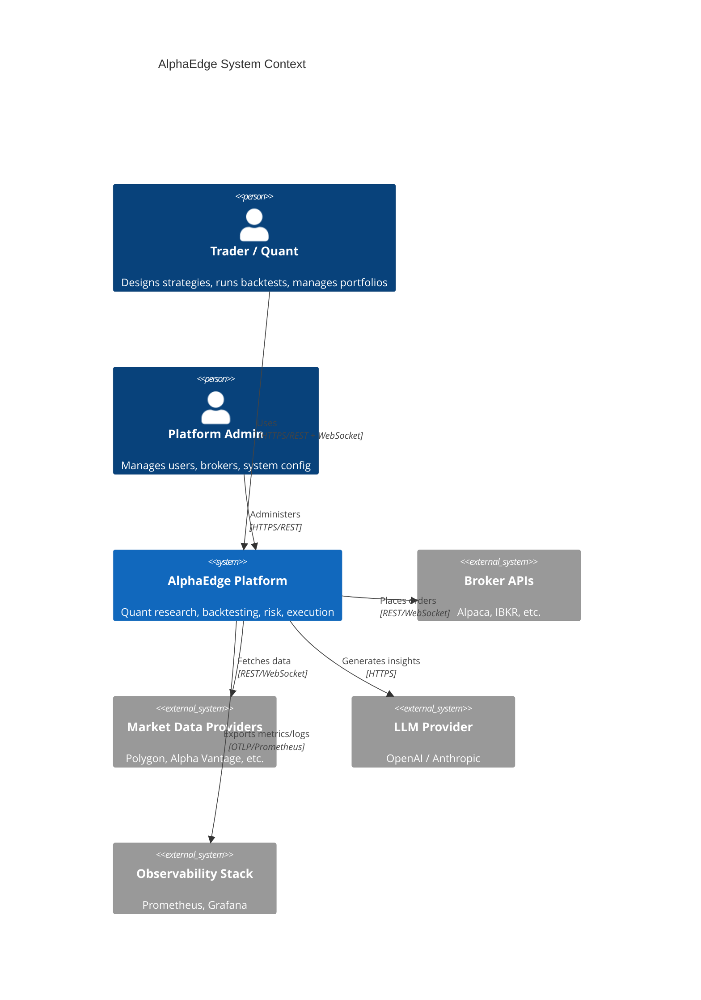
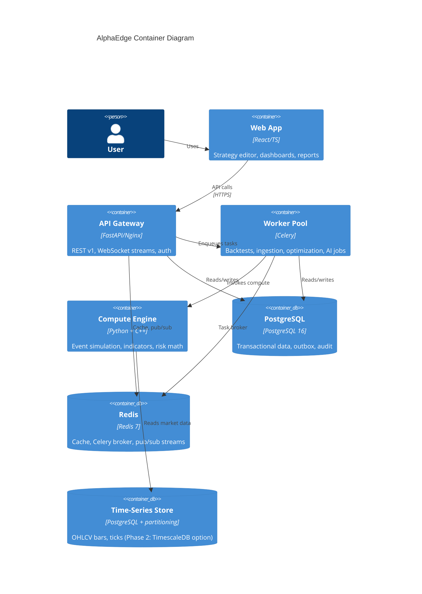

# AlphaEdge — System Architecture

## 1. Executive Summary

AlphaEdge is a **modular monolith** organized as independently deployable **bounded contexts**. Each context owns its domain model, application logic, and persistence adapters. Cross-context communication happens through **domain events** (async via Celery/Redis) and **well-defined application service interfaces** (sync, in-process).

The platform is designed to:

1. Process millions of market events during backtests without sacrificing correctness.
2. Keep strategy authoring accessible (Python + custom DSL) while isolating execution semantics.
3. Provide institutional-grade risk and portfolio analytics.
4. Support paper and live execution through a broker abstraction layer.
5. Enrich quantitative output with LLM-powered narrative insights.

---

## 2. Architectural Style

### 2.1 Clean Architecture Layers

Every bounded context follows the same layer structure:

```
┌─────────────────────────────────────────────────┐
│  Presentation   │  FastAPI routers, Pydantic    │
│                 │  request/response schemas     │
├─────────────────┼───────────────────────────────┤
│  Application    │  Use cases, command/query     │
│                 │  handlers, orchestration, DTOs  │
├─────────────────┼───────────────────────────────┤
│  Domain         │  Entities, value objects,     │
│                 │  domain services, events,     │
│                 │  repository interfaces        │
├─────────────────┼───────────────────────────────┤
│  Infrastructure │  SQLAlchemy repos, Redis,     │
│                 │  Celery tasks, broker APIs,   │
│                 │  C++ bindings, file storage   │
└─────────────────┴───────────────────────────────┘
```

**Dependency rule:** dependencies point inward. Domain has zero framework imports.

### 2.2 Domain-Driven Design

| Bounded Context | Responsibility | Aggregate Roots |
|-----------------|----------------|-----------------|
| **Identity** | Auth, users, roles, API keys | `User`, `Role`, `ApiKey` |
| **Market Data** | Ingestion, normalization, streaming | `Instrument`, `Bar`, `Tick`, `CorporateAction` |
| **Strategy** | DSL, Python runtime, indicators, paper deployments | `Strategy`, `StrategyVersion`, `Indicator`, `StrategyDeployment` |
| **Backtesting** | Event simulation, fills, walk-forward | `BacktestRun`, `BacktestResult` |
| **Portfolio** | Holdings, allocation, rebalancing | `Portfolio`, `Holding`, `RebalancePlan` |
| **Risk** | Metrics, limits, exposure | `RiskSnapshot`, `RiskLimit` |
| **Optimization** | Parameter search | `OptimizationRun`, `OptimizationResult` |
| **Execution** | Orders, fills, broker routing | `Order`, `Execution`, `BrokerConnection` |
| **AI Insights** | LLM reports and explanations | `InsightReport`, `InsightRequest` |

**Shared Kernel:** common value objects (`Money`, `Price`, `Quantity`, `Symbol`, `TimeRange`, `Currency`) and cross-cutting primitives live in `shared/domain/`.

### 2.3 CQRS (Selective)

CQRS is applied where read and write paths diverge significantly:

| Write Model | Read Model | Rationale |
|-------------|------------|-----------|
| Backtest execution events | Backtest analytics dashboard | Heavy aggregation, pre-computed metrics |
| Order lifecycle | Execution audit trail | Append-only writes, paginated reads |
| Market data ingestion | OHLCV query API | Time-series optimized reads (Polars/materialized views) |
| Risk calculation jobs | Risk snapshot API | Expensive compute vs. cached snapshots |

Command handlers mutate aggregates and emit events. Query handlers read from optimized projections or materialized views.

### 2.4 Event-Driven Integration

```
┌──────────┐   BacktestCompleted    ┌──────────┐
│Backtesting│ ─────────────────────► │   Risk   │
└──────────┘                         └──────────┘
      │                                      │
      │ BacktestCompleted                    │ RiskSnapshotCreated
      ▼                                      ▼
┌──────────┐                         ┌──────────┐
│    AI    │                         │ Portfolio│
└──────────┘                         └──────────┘

┌──────────┐   OrderFilled            ┌──────────┐
│Execution │ ─────────────────────►   │ Portfolio│
└──────────┘                         └──────────┘

┌──────────┐   BarIngested            ┌──────────┐
│MarketData│ ─────────────────────►   │ Strategy │  (live signal eval)
└──────────┘                         └──────────┘
```

Events are persisted in an **outbox table** (transactional outbox pattern) and dispatched by Celery workers. This guarantees at-least-once delivery without dual-write problems.

---

## 3. System Context Diagram



---

## 4. Container Diagram



---

## 5. Core Module Deep Dives

### 5.1 Market Data

**Responsibilities:** historical ingestion, live streaming, multi-provider support, validation, normalization, corporate actions.

**Ingestion pipeline:**

```
Provider API → Raw Adapter → Validator → Normalizer → Storage → Domain Event (BarIngested)
```

- **Adapters** implement a common `MarketDataProvider` port (Strategy pattern).
- **Normalizer** maps provider-specific schemas to canonical `Bar` / `Tick` value objects.
- **Validator** checks gaps, outliers, timestamp ordering, split adjustments.
- **Storage:** partitioned PostgreSQL tables by `(instrument_id, timeframe)`; hot data cached in Redis.

**Live streaming:** WebSocket from provider → Redis pub/sub channel per instrument → API WebSocket fan-out to clients.

### 5.2 Strategy Engine

Two authoring modes (both implemented):

1. **Python strategies** — subclass `StrategyBase`, implement `on_bar()`, optional `on_init` / `on_tick` / `on_stop`. Loaded via a restricted sandbox (`PythonStrategyExecutor`).
2. **Custom DSL** — declarative YAML parsed to `CompiledStrategy`, executed by `DSLStrategyExecutor`.

```
DSL Source → Parser → Validator → CompiledStrategy → DSLStrategyExecutor (or C++ when eligible)
Python Source → AST Import Guard → exec sandbox → StrategyBase subclass → PythonStrategyExecutor
```

**Indicator library:** SMA, EMA, RSI, MACD, Bollinger Bands (incremental, shared between DSL and Python `context.indicator()`).

**DSL conditions:** `crossover`, `crossunder`, comparisons (`<`, `>`, …), `all(...)`, `any(...)`.

**Signal generation:** strategies emit `Signal` (BUY/SELL/HOLD) with optional `strength`, `stop_loss_pct`, `take_profit_pct`.

**Paper deployments:** `StrategyDeployment` links a validated version to a portfolio + paper broker. On bar ingestion, `evaluate_deployments_for_bar` runs the same runtime and submits orders. See [STRATEGY_GUIDE.md](../STRATEGY_GUIDE.md).

### 5.3 Backtesting Engine

**Event-driven simulation** (not vectorized-only — vectorized used for indicator pre-computation where safe):

```
Initialize Portfolio State
  → For each MarketEvent (chronological):
      → Update indicators
      → Strategy.on_event()
      → Process signals → Order intents
      → Simulate fills (slippage, partial fills, brokerage)
      → Update positions & cash
      → Record equity curve point
  → Compute result metrics
  → Emit BacktestCompleted event
```

**Performance path:** C++ module (`alphaedge_cpp`) for DSL crossover/crossunder strategies when `CPP_ENGINE=auto` and `allow_short=false`. Advanced DSL and shorts use the Python engine.

**Features (implemented):** fixed/percentage slippage, per-trade commission, position sizing (fixed qty / percent equity), partial fills, multi-instrument, optional short selling (`allow_short`), walk-forward via optimization module.

### 5.4 Portfolio Engine

Tracks holdings, cash, allocation targets, and exposure across strategies and accounts.

- **Rebalancing** generates `RebalancePlan` with proposed trades.
- Listens to `OrderFilled` events from Execution context.
- Provides portfolio state snapshots for Risk engine input.

### 5.5 Risk Engine

Computes metrics on demand and via scheduled snapshots:

| Metric | Method |
|--------|--------|
| VaR (95/99) | Historical simulation, parametric |
| Max Drawdown | Equity curve traversal |
| Sharpe / Sortino | Annualized return / volatility |
| Beta / Alpha | CAPM regression vs. benchmark |
| Correlation | Rolling correlation matrix |
| Volatility | Realized, EWMA |
| Position limits | Rule-based checks against `RiskLimit` aggregate |

Risk snapshots are immutable records linked to a portfolio + timestamp.

### 5.6 Optimization Engine

| Method | Phase | Description |
|--------|-------|-------------|
| Grid Search | Phase 3 | Exhaustive parameter sweep, parallelized via Celery |
| Bayesian Optimization | Phase 4 | Optuna integration, surrogate model |
| Genetic Algorithms | Future | DEAP or custom GA framework |

Each trial runs a backtest with parameter set → objective function (Sharpe, return, custom) → store result.

### 5.7 AI Layer

LLM integration is **read-only analytics** — never executes trades.

| Capability | Input | Output |
|------------|-------|--------|
| Strategy explanation | Strategy source + metadata | Natural language description |
| Trade summary | Backtest/execution trades | Narrative summary |
| Performance report | Metrics + equity curve | Structured report (Markdown/JSON) |
| Risk interpretation | Risk snapshot | Plain-language risk assessment |
| Portfolio insights | Holdings + exposure | Actionable observations |

Prompts are templated, versioned, and stored. All LLM calls are async Celery tasks with rate limiting.

### 5.8 Execution Layer

**Broker abstraction:**

```python
class BrokerPort(Protocol):
    async def submit_order(order: Order) -> OrderAck: ...
    async def cancel_order(order_id: OrderId) -> CancelAck: ...
    async def get_positions() -> list[Position]: ...
    async def get_account() -> AccountInfo: ...
```

Implementations: `PaperBroker`, `AlpacaBroker` (Phase 5), extensible registry.

**Paper trading** simulates fills using latest market data with configurable latency and slippage.

**Order lifecycle:** `PENDING → SUBMITTED → PARTIALLY_FILLED → FILLED | CANCELLED | REJECTED`

Retry with exponential backoff for transient broker errors. All state transitions logged to audit table.

### 5.9 Authentication & Authorization

- **JWT** access tokens (short-lived) + refresh tokens (stored hashed in DB).
- **OAuth 2.0** (Google, GitHub) for social login.
- **RBAC:** roles (`admin`, `trader`, `viewer`, `api_service`) with permission matrix.
- **API keys** for programmatic access (hashed, scoped, revocable).

Middleware chain: `RequestId → Auth → RBAC → RateLimit → Handler`

### 5.10 Observability

| Concern | Implementation |
|---------|---------------|
| Structured logging | `structlog` → JSON, correlation ID per request |
| Metrics | Prometheus client, `/metrics` endpoint |
| Tracing | OpenTelemetry → future Jaeger/Tempo |
| Health checks | `/health/live`, `/health/ready` (DB, Redis, worker) |
| Audit logs | Append-only `audit_log` table, all mutating operations |

---

## 6. Cross-Cutting Concerns

### 6.1 Error Handling

- Domain exceptions mapped to HTTP status codes at presentation layer.
- Never leak internal errors to clients.
- Error response envelope: `{ "error": { "code", "message", "details", "request_id" } }`.

### 6.2 Idempotency

- POST endpoints that create resources accept `Idempotency-Key` header.
- Backtest and optimization job submission is idempotent.

### 6.3 Security

- Secrets via environment variables / AWS Secrets Manager.
- SQL injection prevented by SQLAlchemy parameterized queries.
- Input validation at API boundary (Pydantic) and domain boundary.
- Rate limiting per user/API key via Redis sliding window.
- CORS configured per environment.

### 6.4 Performance Strategy

| Hot Path | Optimization |
|----------|-------------|
| Backtest event loop | C++ module, batch bar loading via Polars |
| Indicator computation | NumPy vectorization, incremental state for live |
| Market data queries | Partitioned tables, Redis cache, read replicas (later) |
| API responses | Pagination, field selection, ETags |

### 6.5 Migration to Microservices

Each bounded context is a Python package with:

- Its own domain model (no cross-imports of entities).
- Its own repository implementations.
- Its own FastAPI router (registered in main app).
- Its own Celery task module.

To extract a microservice: move the package, add a message bus adapter replacing in-process event bus, deploy independently. No domain code changes required.

---

## 7. Deployment Architecture (Phase 1 — Docker Compose)

```
┌─────────────────────────────────────────────────────┐
│                   Docker Compose                     │
│                                                      │
│  ┌─────────┐  ┌─────────┐  ┌──────────┐            │
│  │  Nginx  │→ │ FastAPI │  │  Celery  │            │
│  │  :80    │  │  :8000  │  │  Workers │            │
│  └─────────┘  └────┬────┘  └────┬─────┘            │
│                     │             │                   │
│              ┌──────┴─────────────┴──────┐           │
│              │                           │           │
│         ┌────┴────┐               ┌─────┴────┐      │
│         │ Postgres│               │  Redis   │      │
│         └─────────┘               └──────────┘      │
│                                                      │
│  ┌──────────┐  ┌────────────┐  ┌────────────┐     │
│  │ Prometheus│  │  Grafana   │  │  Frontend  │     │
│  └──────────┘  └────────────┘  └────────────┘     │
└─────────────────────────────────────────────────────┘
```

**AWS (Phase 6):** ECS Fargate or EKS, RDS PostgreSQL, ElastiCache Redis, ALB, S3 for data archives.

---

## 8. Key Design Decisions

| Decision | Choice | Rationale |
|----------|--------|-----------|
| Monolith vs. microservices | Modular monolith | Faster iteration, simpler ops; clean boundaries enable future split |
| ORM | SQLAlchemy 2.0 async | Mature, supports complex queries, async for FastAPI |
| Task queue | Celery + Redis | Proven, supports retries, scheduling, priority queues |
| Backtest engine | Event-driven + C++ hot path | Correctness over pure vectorization; C++ for scale |
| Time-series storage | Partitioned PostgreSQL first | Avoid operational complexity of TimescaleDB until needed |
| API style | REST first, WebSocket for streams | Broad compatibility, OpenAPI tooling |
| Frontend state | React Query + Zustand | Server state caching + minimal client state |
| DSL format | YAML declarative | Human-readable, version-control friendly |

---

## 9. Implementation Status

**Status as of v1.1.0 (2026-07-14):** The platform described in sections 1–8 is **implemented** as a modular monolith. Phases 0–14 are production-ready; Phases 15–33 include polish and partial scaffolds (see honest notes below).

### 9.1 Bounded context maturity

| Context | Status | Notes |
|---------|--------|-------|
| Identity | ✅ Production-ready | JWT, OAuth, RBAC, API keys, rate limits |
| Market Data | ✅ Operational | Mock + Alpha Vantage + Polygon; ingestion via Celery |
| Strategy | ✅ Operational | DSL + Python runtime, versioning, validation, deployments |
| Backtesting | ✅ Operational | Python + optional C++ DSL path; shorts optional |
| Optimization | ✅ Operational | Grid, walk-forward, Bayesian (Optuna), genetic |
| Portfolio & Risk | ✅ Operational | Holdings, VaR, Sharpe, limits, rebalance plans |
| Execution | ✅ Operational | Paper broker, Alpaca adapter; IBKR/Indian/crypto stubs raise errors |
| AI Insights | ✅ Operational | OpenAI + mock provider (no Anthropic) |
| Marketplace / Collab | ✅ Operational | Listings + clone; subscriptions/leaderboards not API-wired |

### 9.2 Strategy & execution data flow (implemented)

```
Authoring                    Backtest                         Paper deploy
─────────                    ────────                         ────────────
POST /strategies             POST /backtest-runs              POST /strategy-deployments
  → versions                   → Celery execute_backtest          → active deployment row
  → validate                   → BacktestEngine                   → on bar ingest:
                                   → DSL or Python executor           StrategyRuntime.on_bar
                                   → metrics + trades                 → SubmitOrder → Celery
```

**Live signal path:** `market_data.run_ingestion` → `bar_repo.upsert_many` → `evaluate_deployments_for_bar` per bar. This is synchronous in the ingestion worker (not a separate domain-event bus yet).

### 9.3 Intentional limitations

| Item | Current behavior |
|------|------------------|
| HOLD signals | Ignored in backtests; logged in paper deployments |
| C++ backtest | Crossover/crossunder DSL only; no shorts or advanced DSL |
| Deployment shorts | Backtest supports `allow_short`; deployments map BUY/SELL to long-only paper orders |
| Outbox / event bus | Dispatcher runs; `store_outbox_event` not called from business code yet |
| OpenTelemetry | Optional (`OTEL_ENABLED=false` default); console exporter only |
| Kelly / volume slippage | Not implemented (architecture aspirational) |

### 9.4 Further reading

- [STRATEGY_GUIDE.md](../STRATEGY_GUIDE.md) — DSL reference, Python runtime, deployment API
- [ROADMAP.md](../ROADMAP.md) — phase history and Phase 13 deliverables
- [API_OVERVIEW.md](API_OVERVIEW.md) — REST endpoint catalog
