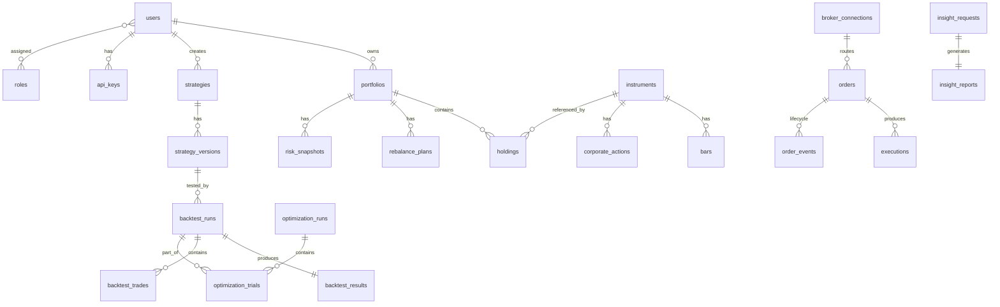

# AlphaEdge — Database Schema (Conceptual)

## 1. Design Principles

- **Normalized** transactional schema in PostgreSQL.
- **UUID primary keys** for all entities (no sequential ID leakage).
- **Timestamps** on every table: `created_at`, `updated_at` (UTC).
- **Soft deletes** where business requires history (`deleted_at`).
- **Audit trail** via append-only `audit_log` table.
- **Outbox pattern** via `outbox_events` for reliable event dispatch.
- Time-series market data uses **table partitioning** by month.

---

## 2. Entity-Relationship Overview



---

## 3. Schema by Bounded Context

### 3.1 Identity

```sql
-- users
id              UUID PK
email           VARCHAR(255) UNIQUE NOT NULL
password_hash   VARCHAR(255)          -- NULL for OAuth-only users
display_name    VARCHAR(100)
is_active       BOOLEAN DEFAULT true
created_at      TIMESTAMPTZ
updated_at      TIMESTAMPTZ

-- roles
id              UUID PK
name            VARCHAR(50) UNIQUE    -- admin, trader, viewer, api_service
description     TEXT

-- user_roles (junction)
user_id         UUID FK → users
role_id         UUID FK → roles
assigned_at     TIMESTAMPTZ

-- oauth_accounts
id              UUID PK
user_id         UUID FK → users
provider        VARCHAR(50)           -- google, github
provider_uid    VARCHAR(255)
access_token    TEXT ENCRYPTED
refresh_token   TEXT ENCRYPTED

-- api_keys
id              UUID PK
user_id         UUID FK → users
name            VARCHAR(100)
key_hash        VARCHAR(255)          -- bcrypt hash of key
prefix          VARCHAR(8)            -- first 8 chars for identification
scopes          JSONB                 -- ["read:strategies", "write:orders"]
expires_at      TIMESTAMPTZ
last_used_at    TIMESTAMPTZ
revoked_at      TIMESTAMPTZ

-- refresh_tokens
id              UUID PK
user_id         UUID FK → users
token_hash      VARCHAR(255)
expires_at      TIMESTAMPTZ
revoked_at      TIMESTAMPTZ
```

### 3.2 Market Data

```sql
-- instruments
id              UUID PK
symbol          VARCHAR(20) NOT NULL
exchange        VARCHAR(20)
asset_class     VARCHAR(20)           -- equity, crypto, forex, futures
currency        VARCHAR(3)
name            VARCHAR(255)
is_active       BOOLEAN DEFAULT true
metadata        JSONB

-- bars (partitioned by month on timestamp)
id              UUID
instrument_id   UUID FK → instruments
timeframe       VARCHAR(10)           -- 1m, 5m, 1h, 1d
timestamp       TIMESTAMPTZ
open            NUMERIC(18,8)
high            NUMERIC(18,8)
low             NUMERIC(18,8)
close           NUMERIC(18,8)
volume          NUMERIC(18,4)
vwap            NUMERIC(18,8)
source          VARCHAR(50)
PRIMARY KEY (instrument_id, timeframe, timestamp)

-- ticks (partitioned, high volume)
id              UUID
instrument_id   UUID FK
timestamp       TIMESTAMPTZ
price           NUMERIC(18,8)
size            NUMERIC(18,4)
side            VARCHAR(4)            -- buy, sell

-- corporate_actions
id              UUID PK
instrument_id   UUID FK
action_type     VARCHAR(20)           -- split, dividend, merger
ex_date         DATE
ratio           NUMERIC(18,8)
amount          NUMERIC(18,8)
metadata        JSONB

-- data_ingestion_jobs
id              UUID PK
provider        VARCHAR(50)
status          VARCHAR(20)           -- pending, running, completed, failed
instruments     JSONB                 -- list of symbols
date_range      TSTZRANGE
records_count   INTEGER
error_message   TEXT
started_at      TIMESTAMPTZ
completed_at    TIMESTAMPTZ
```

### 3.3 Strategy

```sql
-- strategies
id              UUID PK
user_id         UUID FK → users
name            VARCHAR(255)
description     TEXT
strategy_type   VARCHAR(20)           -- python, dsl
is_active       BOOLEAN DEFAULT true
created_at      TIMESTAMPTZ
updated_at      TIMESTAMPTZ

-- strategy_versions
id              UUID PK
strategy_id     UUID FK → strategies
version         INTEGER
source_code     TEXT                  -- Python source or DSL YAML
parameters      JSONB                 -- default parameter schema
compiled_hash   VARCHAR(64)           -- SHA-256 of compiled output
status          VARCHAR(20)           -- draft, validated, published
created_at      TIMESTAMPTZ

-- indicators (catalog)
id              UUID PK
name            VARCHAR(100) UNIQUE
category        VARCHAR(50)
parameters_schema JSONB
implementation  VARCHAR(20)           -- python, cpp
```

### 3.4 Backtesting

```sql
-- backtest_runs
id              UUID PK
user_id         UUID FK → users
strategy_version_id UUID FK → strategy_versions
name            VARCHAR(255)
status          VARCHAR(20)           -- queued, running, completed, failed
config          JSONB                 -- date range, instruments, capital, slippage, etc.
started_at      TIMESTAMPTZ
completed_at    TIMESTAMPTZ
error_message   TEXT
celery_task_id  VARCHAR(255)

-- backtest_results
id              UUID PK
backtest_run_id UUID FK UNIQUE → backtest_runs
total_return    NUMERIC(12,6)
annualized_return NUMERIC(12,6)
sharpe_ratio    NUMERIC(10,4)
sortino_ratio   NUMERIC(10,4)
max_drawdown    NUMERIC(10,4)
win_rate        NUMERIC(6,4)
total_trades    INTEGER
profit_factor   NUMERIC(10,4)
equity_curve    JSONB                 -- [{timestamp, equity}]
metrics         JSONB                 -- full metrics blob

-- backtest_trades
id              UUID PK
backtest_run_id UUID FK → backtest_runs
instrument_id   UUID FK → instruments
side            VARCHAR(4)            -- buy, sell
quantity        NUMERIC(18,4)
entry_price     NUMERIC(18,8)
exit_price      NUMERIC(18,8)
entry_time      TIMESTAMPTZ
exit_time       TIMESTAMPTZ
pnl             NUMERIC(18,4)
commission      NUMERIC(18,4)
slippage        NUMERIC(18,8)
```

### 3.5 Portfolio

```sql
-- portfolios
id              UUID PK
user_id         UUID FK → users
name            VARCHAR(255)
base_currency   VARCHAR(3) DEFAULT 'USD'
initial_capital NUMERIC(18,4)
cash_balance    NUMERIC(18,4)
is_paper        BOOLEAN DEFAULT true
created_at      TIMESTAMPTZ

-- holdings
id              UUID PK
portfolio_id    UUID FK → portfolios
instrument_id   UUID FK → instruments
quantity        NUMERIC(18,4)
avg_cost        NUMERIC(18,8)
current_price   NUMERIC(18,8)
market_value    NUMERIC(18,4)
updated_at      TIMESTAMPTZ

-- rebalance_plans
id              UUID PK
portfolio_id    UUID FK → portfolios
target_allocation JSONB               -- {symbol: weight}
proposed_trades JSONB
status          VARCHAR(20)           -- draft, approved, executed
created_at      TIMESTAMPTZ
```

### 3.6 Risk

```sql
-- risk_snapshots
id              UUID PK
portfolio_id    UUID FK → portfolios
snapshot_at     TIMESTAMPTZ
var_95          NUMERIC(12,6)
var_99          NUMERIC(12,6)
max_drawdown    NUMERIC(10,4)
sharpe_ratio    NUMERIC(10,4)
sortino_ratio   NUMERIC(10,4)
beta            NUMERIC(10,4)
alpha           NUMERIC(10,4)
volatility      NUMERIC(10,4)
correlation_matrix JSONB
metrics         JSONB                 -- full metrics blob

-- risk_limits
id              UUID PK
portfolio_id    UUID FK → portfolios
limit_type      VARCHAR(50)           -- max_position_pct, max_drawdown, max_var
threshold       NUMERIC(12,6)
is_active       BOOLEAN DEFAULT true
```

### 3.7 Optimization

```sql
-- optimization_runs
id              UUID PK
user_id         UUID FK → users
strategy_version_id UUID FK
name            VARCHAR(255)
method          VARCHAR(30)           -- grid_search, bayesian
objective       VARCHAR(50)           -- sharpe_ratio, total_return
parameter_space JSONB
status          VARCHAR(20)
best_trial_id   UUID FK → optimization_trials
created_at      TIMESTAMPTZ

-- optimization_trials
id              UUID PK
optimization_run_id UUID FK
backtest_run_id UUID FK → backtest_runs
parameters      JSONB
objective_value NUMERIC(12,6)
rank            INTEGER
```

### 3.8 Execution

```sql
-- broker_connections
id              UUID PK
user_id         UUID FK → users
broker_name     VARCHAR(50)           -- paper, alpaca, ibkr
credentials     JSONB ENCRYPTED
is_paper        BOOLEAN
is_active       BOOLEAN DEFAULT true

-- orders
id              UUID PK
portfolio_id    UUID FK → portfolios
broker_connection_id UUID FK
instrument_id   UUID FK → instruments
side            VARCHAR(4)
order_type      VARCHAR(20)           -- market, limit, stop
quantity        NUMERIC(18,4)
limit_price     NUMERIC(18,8)
status          VARCHAR(20)
broker_order_id VARCHAR(100)
idempotency_key VARCHAR(255) UNIQUE
created_at      TIMESTAMPTZ
updated_at      TIMESTAMPTZ

-- executions (fills)
id              UUID PK
order_id        UUID FK → orders
quantity        NUMERIC(18,4)
price           NUMERIC(18,8)
commission      NUMERIC(18,4)
executed_at     TIMESTAMPTZ

-- order_events (lifecycle audit)
id              UUID PK
order_id        UUID FK → orders
event_type      VARCHAR(30)
payload         JSONB
created_at      TIMESTAMPTZ
```

### 3.9 AI Insights

```sql
-- insight_requests
id              UUID PK
user_id         UUID FK → users
insight_type    VARCHAR(50)           -- strategy_explanation, performance_report, etc.
source_type     VARCHAR(50)           -- backtest, portfolio, risk_snapshot
source_id       UUID
status          VARCHAR(20)
created_at      TIMESTAMPTZ

-- insight_reports
id              UUID PK
insight_request_id UUID FK UNIQUE
content         TEXT                  -- Markdown report
metadata        JSONB                 -- model, tokens, prompt_version
created_at      TIMESTAMPTZ
```

### 3.10 Cross-Cutting

```sql
-- outbox_events
id              UUID PK
aggregate_type  VARCHAR(100)
aggregate_id    UUID
event_type      VARCHAR(100)
payload         JSONB
created_at      TIMESTAMPTZ
processed_at    TIMESTAMPTZ

-- audit_log
id              UUID PK
user_id         UUID
action          VARCHAR(100)
resource_type   VARCHAR(100)
resource_id     UUID
changes         JSONB
ip_address      INET
request_id      VARCHAR(36)
created_at      TIMESTAMPTZ
```

---

## 4. Indexing Strategy

| Table | Index | Purpose |
|-------|-------|---------|
| `bars` | `(instrument_id, timeframe, timestamp DESC)` | Primary query pattern |
| `backtest_runs` | `(user_id, status, created_at DESC)` | User dashboard |
| `orders` | `(portfolio_id, status, created_at DESC)` | Active orders |
| `holdings` | `(portfolio_id, instrument_id)` UNIQUE | Upsert on fill |
| `outbox_events` | `(processed_at) WHERE processed_at IS NULL` | Outbox polling |
| `audit_log` | `(user_id, created_at DESC)` | Audit queries |

---

## 5. Migration Strategy

- **Alembic** for all schema changes.
- One migration per feature/module increment.
- Migrations are reviewed in PRs alongside code.
- Destructive migrations require explicit ADR approval.
- Seed scripts for development data (instruments, sample bars).
