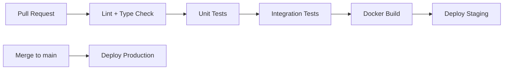

# AlphaEdge — Repository Structure

## 1. Monorepo Layout

```
alpha-edge/
├── .github/
│   └── workflows/                  # CI/CD pipelines
│       ├── backend-ci.yml
│       ├── frontend-ci.yml
│       ├── docker-build.yml
│       └── deploy-staging.yml
│
├── backend/
│   ├── pyproject.toml              # Python project config (uv/poetry)
│   ├── alembic/                    # Database migrations
│   │   ├── alembic.ini
│   │   └── versions/
│   ├── src/
│   │   └── alphaedge/
│   │       ├── __init__.py
│   │       ├── main.py             # FastAPI app factory
│   │       ├── config.py           # Settings (Pydantic BaseSettings)
│   │       ├── dependencies.py     # FastAPI DI wiring
│   │       │
│   │       ├── shared/             # Shared kernel
│   │       │   ├── domain/
│   │       │   │   ├── value_objects.py    # Money, Price, Symbol, etc.
│   │       │   │   ├── events.py           # Base domain event
│   │       │   │   └── exceptions.py
│   │       │   ├── application/
│   │       │   │   ├── bus.py              # Command/Query/Event buses
│   │       │   │   └── unit_of_work.py
│   │       │   └── infrastructure/
│   │       │       ├── database.py         # Engine, session factory
│   │       │       ├── redis.py
│   │       │       ├── celery_app.py
│   │       │       ├── outbox.py           # Transactional outbox
│   │       │       └── logging.py
│   │       │
│   │       └── modules/            # Bounded contexts
│   │           ├── identity/
│   │           ├── market_data/
│   │           ├── strategy/
│   │           ├── backtesting/
│   │           ├── portfolio/
│   │           ├── risk/
│   │           ├── optimization/
│   │           ├── execution/
│   │           └── ai/
│   │
│   └── tests/
│       ├── conftest.py
│       ├── unit/
│       ├── integration/
│       └── e2e/
│
├── cpp/                            # Performance-critical modules
│   ├── CMakeLists.txt
│   ├── include/
│   │   └── alphaedge/
│   │       ├── event_loop.hpp
│   │       ├── indicators.hpp
│   │       └── fill_simulator.hpp
│   ├── src/
│   │   ├── event_loop.cpp
│   │   ├── indicators.cpp
│   │   └── fill_simulator.cpp
│   └── bindings/
│       └── python_bindings.cpp     # pybind11
│
├── frontend/
│   ├── package.json
│   ├── tsconfig.json
│   ├── tailwind.config.ts
│   ├── vite.config.ts
│   └── src/
│       ├── app/                    # Router, providers
│       ├── components/             # Shared UI components
│       ├── features/               # Feature modules (mirror backend contexts)
│       │   ├── auth/
│       │   ├── strategies/
│       │   ├── backtests/
│       │   ├── portfolio/
│       │   ├── risk/
│       │   └── execution/
│       ├── hooks/
│       ├── lib/                    # API client, utils
│       └── types/
│
├── docker/
│   ├── Dockerfile.api
│   ├── Dockerfile.worker
│   ├── Dockerfile.frontend
│   └── nginx/
│       └── nginx.conf
│
├── infrastructure/
│   ├── docker-compose.yml
│   ├── docker-compose.dev.yml
│   ├── prometheus/
│   │   └── prometheus.yml
│   └── grafana/
│       └── provisioning/
│
├── docs/
│   ├── architecture/
│   ├── adr/                        # Architecture Decision Records
│   └── api/                        # Generated OpenAPI specs
│
├── scripts/
│   ├── seed_data.py
│   ├── run_backtest_cli.py
│   └── dev_setup.sh
│
├── .env.example
├── .gitignore
├── Makefile                        # Common dev commands
└── README.md
```

---

## 2. Module Internal Structure

Every bounded context under `backend/src/alphaedge/modules/` follows this layout:

```
modules/<context_name>/
├── __init__.py
├── domain/
│   ├── __init__.py
│   ├── entities.py             # Aggregate roots, entities
│   ├── value_objects.py        # Context-specific value objects
│   ├── events.py               # Domain events
│   ├── services.py             # Domain services (pure logic)
│   ├── repositories.py         # Repository interfaces (ABC)
│   └── exceptions.py             # Domain-specific exceptions
│
├── application/
│   ├── __init__.py
│   ├── commands.py             # Command dataclasses
│   ├── queries.py                # Query dataclasses
│   ├── handlers/
│   │   ├── command_handlers.py
│   │   └── query_handlers.py
│   └── dto.py                    # Data transfer objects
│
├── infrastructure/
│   ├── __init__.py
│   ├── models.py                 # SQLAlchemy ORM models
│   ├── repositories.py           # Repository implementations
│   ├── mappers.py                # Entity ↔ ORM mapping
│   └── tasks.py                  # Celery tasks (if async work)
│
└── presentation/
    ├── __init__.py
    ├── router.py                 # FastAPI APIRouter
    └── schemas.py                # Pydantic request/response models
```

### Rules

1. **Domain layer** imports nothing from application, infrastructure, or presentation.
2. **Application layer** imports domain only.
3. **Infrastructure layer** implements domain interfaces; may import domain + application.
4. **Presentation layer** calls application handlers; never touches infrastructure directly.
5. **Cross-module imports** are forbidden at the domain level. Modules communicate via events or application service interfaces registered in DI.

---

## 3. Naming Conventions

| Element | Convention | Example |
|---------|-----------|---------|
| Python packages | snake_case | `market_data` |
| Python classes | PascalCase | `BacktestRun` |
| Python functions | snake_case | `run_backtest` |
| API paths | kebab-case, plural nouns | `/api/v1/backtest-runs` |
| DB tables | snake_case, plural | `backtest_runs` |
| DB columns | snake_case | `created_at` |
| Domain events | PascalCase past tense | `BacktestCompleted` |
| Commands | PascalCase imperative | `RunBacktestCommand` |
| Queries | PascalCase noun phrase | `GetBacktestResultQuery` |
| Env variables | SCREAMING_SNAKE | `DATABASE_URL` |
| TypeScript files | kebab-case or PascalCase for components | `backtest-chart.tsx` |

---

## 4. Configuration Management

```
Environment Variables
  └── config.py (Pydantic BaseSettings)
        ├── database_url
        ├── redis_url
        ├── jwt_secret
        ├── celery_broker_url
        ├── llm_api_key
        └── broker credentials (per-connection, stored encrypted in DB)
```

- `.env` for local development (gitignored).
- `.env.example` committed with placeholder values.
- Production secrets via AWS Secrets Manager or environment injection.

---

## 5. Testing Strategy

| Layer | Test Type | Location | Tools |
|-------|-----------|----------|-------|
| Domain | Unit | `tests/unit/modules/<ctx>/domain/` | pytest |
| Application | Unit (mocked repos) | `tests/unit/modules/<ctx>/application/` | pytest |
| Infrastructure | Integration | `tests/integration/` | pytest + testcontainers (Postgres, Redis) |
| Presentation | Integration | `tests/integration/` | httpx AsyncClient |
| End-to-end | E2E | `tests/e2e/` | Full stack via docker-compose |
| C++ | Unit | `cpp/tests/` | Google Test |
| Frontend | Component + E2E | `frontend/src/**/*.test.tsx` | Vitest, Playwright |

**Coverage target:** 80%+ on domain and application layers.

---

## 6. CI/CD Pipeline



GitHub Actions workflows:

- **backend-ci.yml:** ruff, mypy, pip-audit, pytest (unit + integration), C++ extension build
- **frontend-ci.yml:** oxlint, npm audit, tsc + vite build
- **dependabot.yml:** weekly pip/npm dependency PRs

Docker image build and Playwright e2e are run locally (`make dev`, `cd frontend && npx playwright test`), not in CI. See [docs/CI.md](../CI.md).

---

## 7. Makefile Commands (Planned)

```makefile
make dev          # Start docker-compose dev stack
make test         # Run all tests
make lint         # Run linters
make migrate      # Run Alembic migrations
make seed         # Seed development data
make backtest     # CLI backtest runner
make docs         # Generate OpenAPI spec
```
